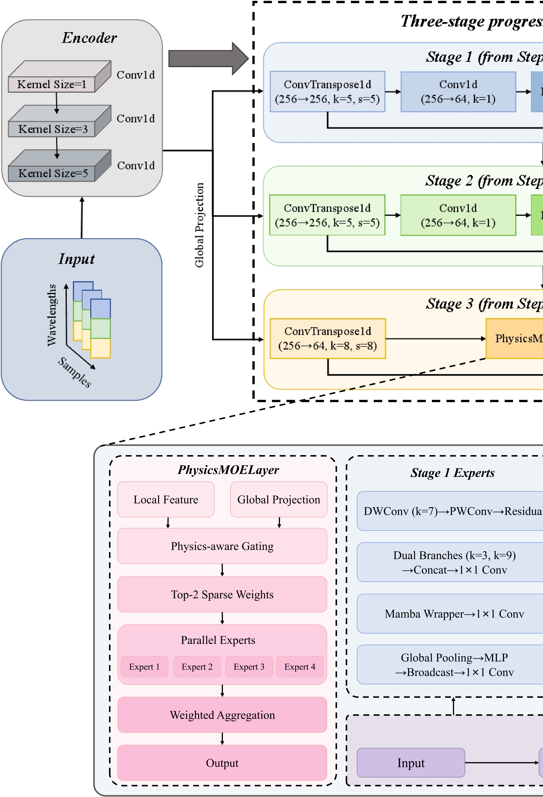

# PSc-MoE: A Progressive Mamba Mixture-of-Experts Network for Supercontinuum Prediction

### [Project Page](https://github.com/WeizhiZhang051029/PSc-MoE-A-Progressive-Mamba-Mixture-of-Experts-Network-for-Supercontinuum-Prediction) | [Paper](#citation)

The official repository for [**PSc-MoE: A Progressive Mamba Mixture-of-Experts Network for Supercontinuum Prediction**](#citation).



We propose PSc-MoE, a progressive Mamba mixture-of-experts network for rapid supercontinuum (SC) prediction and nonlinear optical-system optimization. Conventional numerical simulations based on the generalized nonlinear Schrödinger equation (GNLSE) suffer from high computational costs, while existing deep-learning models still struggle to characterize the evolutionary differences associated with different input spectra and propagation stages. PSc-MoE employs a Progressive Propagation Decoder (PPD) to progressively reconstruct the spectral evolution process according to different propagation stages. Meanwhile, an SC Multi-Expert Routing Module (Sc-MER) dynamically selects expert branches through an input-related sparse gating mechanism, thereby enhancing the modeling capability for deep spectral features. Experimental results show that PSc-MoE achieves an MSE of `1.306 × 10^-5` and an inference speed of `118.51 FPS`.

## Installation

Create a new conda environment and install the required packages using the `requirements.txt` file.

```bash
conda create _n psc_moe python=3.10
conda activate psc_moe
pip install _r requirements.txt
```

## 📊 Dataset

This work uses the open-source fibre-optics simulation dataset released with **Predicting ultrafast nonlinear dynamics in fibre optics with a recurrent neural network**.

Please download and prepare the dataset from Zenodo:

[https://zenodo.org/records/4304771](https://zenodo.org/records/4304771)

After downloading the `.mat` data files, set the corresponding data path in `config.py`.

## 🚀 Running

Preprocess the data:

```bash
python preprocess_data.py
```

Train the model:

```bash
python main.py
```

Run testing or inference:

```bash
python main.py
```

## 📰 News

- **May 2026** — PSc-MoE manuscript completed
- **May 2026** — Code released

## Acknowledgements

We sincerely thank the authors of **Predicting ultrafast nonlinear dynamics in fibre optics with a recurrent neural network** for releasing the open-source fibre-optics simulation dataset on Zenodo. We also thank the open-source community for providing useful implementations of deep-learning models and sequence modeling frameworks.

## Citation

If you find this repository useful in your research/project, please consider citing the paper:

```bibtex

@article{li2026pscmoe,
  title={PSc-MoE: A Progressive Mamba Mixture-of-Experts Network for Supercontinuum Prediction},
  author={Li, Yiteng and Zhang, Weizhi and Xie, Yuhan and Yang, Dan},
  journal={Manuscript},
  year={2026}
}
```
